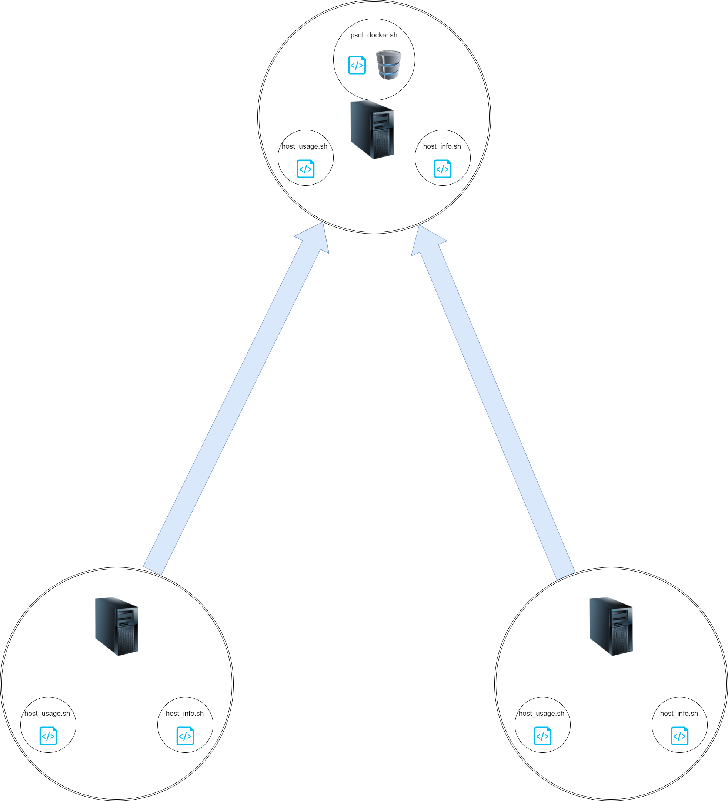

# Linux Cluster Monitoring Agent

# Introduction
This set of bash scripts is designed to run on a cluster of Linux machines. This will survey the specs of every machine in the network
and store them in a central machine. It will then record the performance specs of every machine into the database, every minute.

The database used for this is a Postgres SQL database, hosted on a Docker container running on one of the machines in the cluster.

# Quick Start
1. Install `host_info.sh` and `host_usage.sh` onto every machine. Install `psql_docker.sh` onto the machine where you wish to 
store the database of machine information. For the rest of this tutorial, I am assuming that the folder where these scripts are
is `/yourpath/scripts`

2. Create a PSQL docker container by running:

`bash psql_docker.sh create [USERNAME] [PASSWORD]`

3. Create a database named `[DATABASE NAME]` in the PSQL container and then create the tables `host_info` and `host_usage` by taking the 
`ddl.sql` file and running:

`psql -h localhost -p 5432 -U postgres -c "CREATE DATABASE [DATABASE NAME];"`

`psql -h [PSQL HOST] -U [USERNAME] -d host_agent -f sql/ddl.sql`

4. Run `host_info.sh` on every machine once to survey the basic specs of your machine:

`bash host_info.sh [PSQL HOST] [PORT #] [DATABASE NAME] [PSQL USERNAME] [PSQL PASSWORD]`

5. Create a new cron job on the system with `psql_docker.sh` by running `crontab -e` and then pasting in

`* * * * * bash /yourpath/scripts/host_usage.sh [PSQL HOST] [PORT #] [DATABASE NAME] [PSQL USERNAME] [PSQL PASSWORD] &> /tmp/host_usage.log` 

# Implementation
## Architecture

## Scripts
### psql_docker.sh
This script will either create, start or stop a docker container with an instance of Postgres SQL inside that holds our database.
It will be run on only one machine.

`bash psql_docker.sh create|start|stop [USERNAME] [PASSWORD]`

### host_info.sh
This script is run once on every machine and records the specs of the system into the host_info table of the database.

`bash host_info.sh [PSQL HOST] [PORT #] [DATABASE NAME] [PSQL USERNAME] [PSQL PASSWORD]`

### host_usage.sh
When this script is run, it will take the current performance stats of the machine and record it into the host_usage table of the database.

`bash host_usage.sh [PSQL HOST] [PORT #] [DATABASE NAME] [PSQL USERNAME] [PSQL PASSWORD]`

While the above way allows you to manually add an entry to the database, it should typically be done through a cronjob that executes every
minute like below.

`* * * * * bash /yourpath/scripts/host_usage.sh [PSQL HOST] [PORT #] [DATABASE NAME] [PSQL USERNAME] [PSQL PASSWORD] &> /tmp/host_usage.log` 

## Database Modeling
### host_info table
      Column      |            Type             |                       Modifiers
------------------+-----------------------------+--------------------------------------------------------
 id               | integer                     | not null default nextval('host_info_id_seq'::regclass)
 hostname         | character varying           | not null
 cpu_number       | smallint                    | not null
 cpu_architecture | character varying           | not null
 cpu_model        | character varying           | not null
 cpu_mhz          | double precision            | not null
 l2_cache         | integer                     | not null
 timestamp        | timestamp without time zone |
 total_mem        | integer                     |

 ### host_usage table
     Column     |            Type             |                          Modifiers
----------------+-----------------------------+--------------------------------------------------------------
 timestamp      | timestamp without time zone | not null
 host_id        | integer                     | not null default nextval('host_usage_host_id_seq'::regclass)
 memory_free    | integer                     | not null
 cpu_idle       | smallint                    | not null
 cpu_kernel     | smallint                    | not null
 disk_io        | integer                     | not null
 disk_available | integer                     | not null

# Test
All scripts, the cronjob and the database were run on one machine and it all worked. This should also work on a cluster but, would need
further testing to be 100% sure.

# Deployment
The project is deployed by following the instructions in the Quickstart section. However, in broad terms, one system requires docker and
this system will run `psql_docker.sh` which will manage a docker container with a Postgres SQL database.

Every system will also have a `host_info.sh` script that will be executed once and `host_usage.sh` script that will be executed every 
minute using a cronjob.

# Improvement
1. The `host_info` table should be updated on restart, to ensure it adapts to hardware changes
2. The `host_info` table should not allow duplicate systems in the table
3. All the scripts should have more descriptive logs on success.